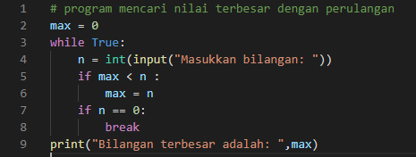
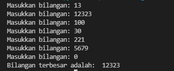

# Perulangan
## latihan 1
### Program nilai random
1. Tampilkan n bilangan acak yang lebih kecil dari 0.5.
2. nilai n diisi pada saat runtime
3. anda bisa menggunakan kombinasi while dan for untuk menyelesaikannya
4. gunakan fungsi random() yang dapat diimport terlebih dahulu
- <b>Program</b><p>
```bash
from random import random
n = int(input("Masukkan nilai N: "))
for i in range(n):
    while 1:
        n = random()
        if (n < 0.5):
            break
    print("data ke: ",i, "=>",n)
print("Selesai")
```
<P>
- Hasil program<p>
<P>
<p>

## Latihan 2
### Program mencari bilangan terbesar
1. Buat program untuk menampilkan bilangan terbesar dari n buah data yang diinputkan. Masukkan angka 0 untuk berhenti.<P>
- <b>program</b><p>
```bash
max = 0
while True:
    n = int(input("Masukkan bilangan: "))
    if max < n :
        max = n
    if n == 0:
        break
print("Bilangan terbesar adalah: ",max)
```
<p>
- penjelasan<p>
max () adalah fungsi bulid-in untuk mencari nilai tertinggi<p>
- <b>Hasil Program</b><p>

