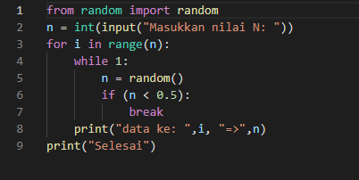
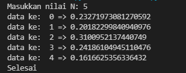

# Perulangan
## latihan 1
### Program nilai random
1. Tampilkan n bilangan acak yang lebih kecil dari 0.5.
2. nilai n diisi pada saat runtime
3. anda bisa menggunakan kombinasi while dan for untuk menyelesaikannya
4. gunakan fungsi random() yang dapat diimport terlebih dahulu
- Program input

>    from random import random

    n = int(input("Masukkan nilai N: "))

    for i in range(n):

        while 1:

            n = random()

            if (n < 0.5):

             break

        print("data ke: ",i, "=>",n)

    print("Selesai")

- Hasil program

